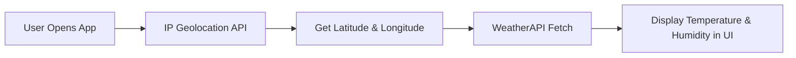

# 🌦 Weather App

A **Next.js** and **Tailwind CSS** based weather application that provides **real-time weather updates** based on your location.  
It automatically detects your city using IP geolocation and fetches live weather conditions, including temperature, humidity, and more, from [WeatherAPI](https://www.weatherapi.com/).
This App was created in order to understand the implementation of API keys, env.local file and async functions to return values from the JSON API Data.
---

## 🚀 Getting Started

First, clone the repository and install dependencies:

```bash
git clone https://github.com/naman-1905/Weather-App.git
cd weather-app
npm install
```

Run the development server:

```bash
npm run dev
# or
yarn dev
# or
pnpm dev
# or
bun dev
```

Open [http://localhost:3000](http://localhost:3000) in your browser to view the app.

---

## ⚙ Environment Variables

Create a `.env.local` file in the root directory and add:

```env
NEXT_PUBLIC_WEATHER_API_KEY=your_weatherapi_key
```

---

## 📌 Features

- **Automatic Location Detection** – Finds your city using IP-based geolocation.  
- **Live Weather Data** – Shows current temperature, humidity, and conditions.  
- **Responsive UI** – Works seamlessly on both desktop and mobile.  
- **Additional Weather Insights** – Air quality, 24-hour data, and historical trends.  

---

## 🛠 Tech Stack

- **Next.js**
- **Tailwind CSS**  
- **WeatherAPI**  
- **IP based Geolocation Detection**  

---

## 🔄 How It Works



---

